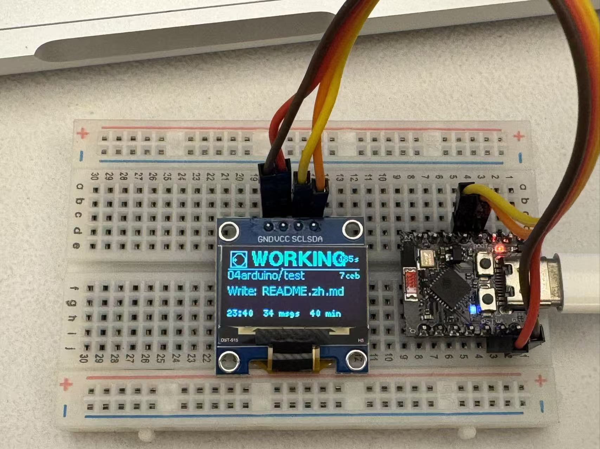

# Claude Code Display

> A small WiFi-connected OLED display that tells you when Claude Code needs your attention — so you don't have to keep your eyes glued to the terminal.

[中文文档 →](README.zh.md)

<p align="center">
  
</p>

<sub>Live shot — `WORKING` state, showing the current tool (`Edit: README.zh.md`) and elapsed time. Watch a [short video demo](docs/videos/demo.mp4).</sub>

## For Claude Code users — one-shot install

```bash
git clone https://github.com/zz-big/claude-code-display.git
cd claude-code-display
claude
```

Then in Claude Code, just say:

> install this for me

The repo ships with a [`CLAUDE.md`](CLAUDE.md) and a [`SKILL.md`](SKILL.md) that walk Claude Code through the host-side configuration — copying the hook script to `~/.claude/hooks/`, merging the hooks block into `~/.claude/settings.json`, validating connectivity to your ESP32, and testing.

You still flash the firmware manually (see [§ Quick start → Flash the firmware](#1--flash-the-firmware) below), but everything between "ESP32 is on the network" and "Claude Code talks to it" is automated.

## What it does

When Claude Code is running, this hardware shows the current state at a glance:

| State       | Visual                                | When                                                   |
|-------------|---------------------------------------|--------------------------------------------------------|
| **WAITING** | full-screen inverted flash, every 400ms | Claude is asking permission to use a tool             |
| **WORKING** | spinning dot icon + tool name           | a tool is running (`Bash`, `Edit foo.py`, ...)        |
| **DONE**    | checkmark + "took 14s"                  | a turn finished                                        |
| **ERROR**   | X icon, fast inverted flash             | a tool call returned an error                          |
| **IDLE**    | clock + today's stats                   | nothing happening                                      |

Multiple concurrent Claude Code sessions are tracked separately and rotated on screen. The display always prioritizes WAITING — if any session needs your attention, the screen locks onto it until you act.

UTF-8 (Chinese, emoji-free CJK) is rendered correctly thanks to u8g2 + GB2312 fonts.

## Hardware

- **ESP32-C3 Super Mini** (or any ESP32 board with 2.4 GHz WiFi)
- **0.96" OLED display, SSD1306, 128×64, I2C**
- USB-C cable

| OLED module | ESP32-C3 Super Mini pinout |
|---|---|
|  |  |

Wiring (default pins, change in `firmware/claude_status/claude_status.ino` if needed):

| OLED  | ESP32-C3 Super Mini |
|-------|---------------------|
| GND   | GND                 |
| VCC   | 3V3                 |
| SCL   | GPIO 9              |
| SDA   | GPIO 8              |

## Quick start

### 1 · Flash the firmware

Install the Arduino libraries (Arduino IDE → Library Manager):
- **U8g2** by Oliver
- **ArduinoJson** by Benoit Blanchon

And the ESP32 board package via Boards Manager (search "esp32" by Espressif).

Configure your WiFi:
```bash
cd firmware/claude_status
cp config.h.example config.h
# edit config.h with your WiFi credentials and timezone
```

Open `firmware/claude_status/claude_status.ino` in Arduino IDE:
- Board: **ESP32C3 Dev Module**
- Partition Scheme: **Default 4MB with spiffs** is fine
- Upload

After boot the OLED shows the device's IP. The device is also reachable at `http://claude-display.local` via mDNS.

### 2 · Install the hook

```bash
mkdir -p ~/.claude/hooks
cp hooks/claude-display.sh ~/.claude/hooks/
chmod +x ~/.claude/hooks/claude-display.sh
```

If `claude-display.local` doesn't resolve on your network (corporate / guest WiFi often blocks mDNS), set the device URL in the hook config file:
```bash
cat > ~/.claude/hooks/claude-display.conf <<'EOF'
CLAUDE_DISPLAY_URL=http://192.168.x.x/status
EOF
```
Use the IP shown on the bottom of the OLED at boot. The hook script sources this file at runtime, which is more reliable than `~/.zshrc` because Claude Code spawns hooks as non-login subprocesses that don't inherit shell rc env vars.

### 3 · Wire up Claude Code hooks

Merge the `hooks` block from [`examples/settings.json`](examples/settings.json) into `~/.claude/settings.json`. Then **fully quit and relaunch Claude Code** — hooks load at session start.

### 4 · Test

In Claude Code, send any prompt. The screen should switch to WORKING.

To test independently of Claude Code:
```bash
curl -X POST http://claude-display.local/status \
  -H "Content-Type: application/json" \
  -d '{"state":"waiting","msg":"need permission","session":"demo"}'
```

The screen should flash WAITING. Then clean up:
```bash
curl -X POST http://claude-display.local/clear
```

> **For Claude Code users**: there's a [`SKILL.md`](SKILL.md) that lets Claude install and configure the host side automatically.

## How it works

```
Claude Code event   →   shell hook   →   curl POST   →   ESP32 HTTP server   →   OLED
   (e.g. Notification)    (~/.claude/hooks/...)            (your LAN)              (visible from across the room)
```

Each Claude Code event (`UserPromptSubmit`, `PreToolUse`, `Notification`, `Stop`, ...) fires the shell hook, which posts JSON to the ESP32. The firmware tracks per-session state and renders the most attention-worthy session, or a clock when nothing's happening.

The hook script has a 1-second `curl` timeout and runs in the background, so an offline display never blocks Claude Code.

## HTTP API

| Endpoint      | Method | Description                                                     |
|---------------|--------|-----------------------------------------------------------------|
| `/status`     | POST   | Push state. JSON: `{state, msg, project, session}`              |
| `/status`     | GET    | List active sessions + today's stats                            |
| `/clear`      | POST   | Drop all active sessions                                        |
| `/`           | GET    | Plain HTML status page                                          |

State values: `idle` · `working` · `waiting` · `done` · `error`

## Configuration

### Firmware (`firmware/claude_status/config.h`)
- `WIFI_SSID`, `WIFI_PASSWORD`
- `MDNS_NAME` — hostname for mDNS (default `claude-display`)
- `TZ_OFFSET_SEC` — UTC offset in seconds for the clock

### Hook script
Persistent settings live in `~/.claude/hooks/claude-display.conf` (sourced as POSIX shell). See [`examples/claude-display.conf.example`](examples/claude-display.conf.example).
- `CLAUDE_DISPLAY_URL` — full URL of the device's `/status` endpoint. Default: `http://claude-display.local/status`.
- `CLAUDE_DISPLAY_LOG` — log file path. Default: `~/.claude/hooks/claude-display.log`.

Both can also be set as env vars (env wins over the conf file).

### Firmware constants (in the `.ino`, less commonly tweaked)
- `MAX_SESSIONS` — how many concurrent sessions to track (default 4)
- `SESSION_ROTATE_MS` — how fast to rotate when multiple sessions are active
- `WORKING_TIMEOUT_MS` — auto-revert WORKING → IDLE after this long without an event
- `DONE_LINGER_MS` — how long DONE sticks before yielding to the clock

## Troubleshooting

**Screen stays on WAITING after the prompt was approved**
A stale session, usually from a manual `curl` test. Run `curl -X POST http://claude-display.local/clear`. Real Claude Code events won't leave orphans because subsequent hooks (`PreToolUse`, `Stop`, ...) overwrite the session's state.

**WiFi never connects**
- ESP32-C3 only supports 2.4 GHz WiFi. If your SSID is 5 GHz only, it can't connect.
- Try a different USB power source — when the ESP32-C3 Super Mini is underpowered, it sometimes resets the radio mid-handshake.

**OLED shows blank or garbled text**
- Default font (`u8g2_font_wqy12_t_gb2312`) needs ~80 KB of flash. If your board's app partition is small, switch to a smaller subset like `u8g2_font_wqy12_t_chinese3` (~50 KB), at the cost of some less-common Chinese characters.

**Compile error: `text section exceeds available space in board`**
Switch the partition scheme to **Huge APP (3MB No OTA/1MB SPIFFS)** in Arduino IDE → Tools → Partition Scheme.

**Hooks aren't firing**
- Hooks load at session start; restart Claude Code after editing `settings.json`.
- Check `~/.claude/hooks/claude-display.log` — every hook invocation appends a line.
- Validate `~/.claude/settings.json` is valid JSON: `python3 -c "import json,sys; json.load(open(sys.argv[1]))" ~/.claude/settings.json`.

## Project layout

```
claude-code-display/
├── README.md / README.zh.md
├── CLAUDE.md                               # Project hint Claude Code reads on open
├── SKILL.md                                # Step-by-step install guide for Claude Code
├── LICENSE                                 # MIT
├── firmware/
│   └── claude_status/
│       ├── claude_status.ino               # Sketch (English comments throughout)
│       └── config.h.example                # Copy to config.h and edit
├── hooks/
│   └── claude-display.sh                   # Shell hook executed by Claude Code events
├── examples/
│   └── settings.json                       # Hooks block to merge into ~/.claude/settings.json
└── docs/
    ├── images/                             # README photos (demo, hardware refs)
    └── videos/                             # README demo video
```

## License

MIT — see [LICENSE](LICENSE).
