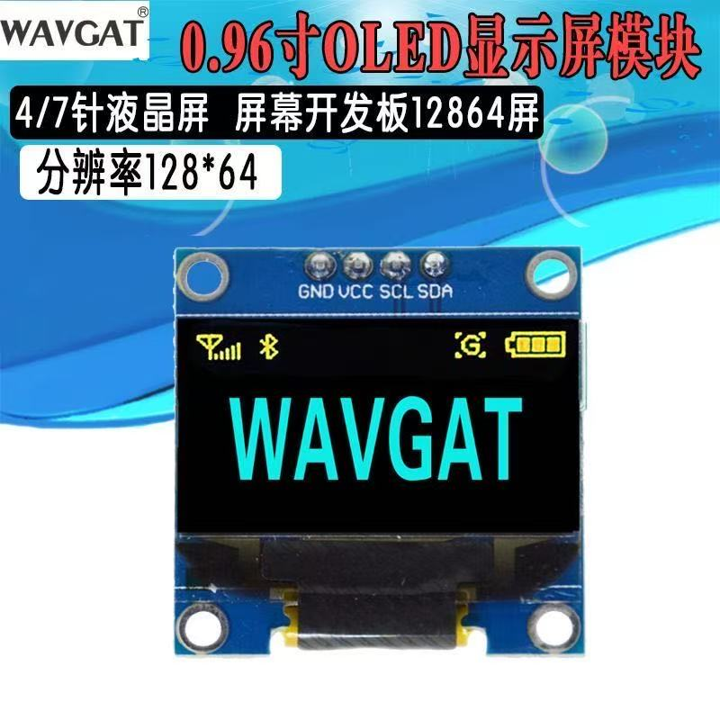
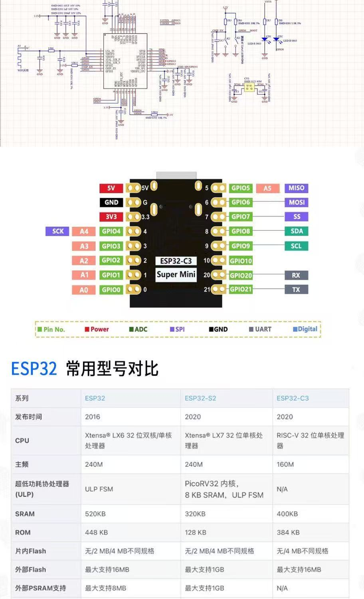

# Claude Code Display

> 一块 WiFi 连网的小 OLED 屏，告诉你 Claude Code 啥时候需要你看一眼 —— 不用再死盯终端。

[English →](README.md)


<sub>实拍 —— `WORKING` 状态，正在编辑 `README.zh.md`，右上角显示已用时长。还有[短视频演示](docs/videos/demo.mp4)。</sub>

## 它能干嘛

Claude Code 工作时，硬件屏幕一眼就能看出当前在啥状态：

| 状态        | 视觉效果                              | 触发时机                                       |
|-------------|---------------------------------------|-----------------------------------------------|
| **WAITING** | 整屏反白闪烁，每 400ms 切换           | Claude 在请求工具使用许可                      |
| **WORKING** | 旋转点图标 + 工具名                   | 正在跑工具（`Bash`、`Edit foo.py` 等）         |
| **DONE**    | 对勾 + "took 14s"                     | 一轮回复结束                                   |
| **ERROR**   | X 图标 + 250ms 急速反白闪烁           | 工具调用返回错误                               |
| **IDLE**    | 时钟 + 今日统计                       | 没事干                                         |

多个 Claude Code 同时跑会被分别追踪，屏幕上轮播显示。**WAITING 永远优先** —— 只要有任何 session 需要你处理，屏幕就锁定在它上面闪烁，直到你处理完。

UTF-8 中文（项目名、错误消息等）通过 u8g2 + GB2312 字体正常渲染。

## 硬件清单

- **ESP32-C3 Super Mini**（或任意支持 2.4 GHz WiFi 的 ESP32 板）
- **0.96" OLED 屏，SSD1306 驱动，128×64，I2C**
- USB-C 数据线

| OLED 模块 | ESP32-C3 Super Mini 引脚图 |
|---|---|
|  |  |

接线（默认引脚，要改去 `firmware/claude_status/claude_status.ino` 里调）：

| OLED  | ESP32-C3 Super Mini |
|-------|---------------------|
| GND   | GND                 |
| VCC   | 3V3                 |
| SCL   | GPIO 9              |
| SDA   | GPIO 8              |

## 快速上手

### 1 · 烧录固件

Arduino IDE → 库管理器装：
- **U8g2** by Oliver
- **ArduinoJson** by Benoit Blanchon

板子包：开发板管理器搜 "esp32" 装 by Espressif。

配置 WiFi：
```bash
cd firmware/claude_status
cp config.h.example config.h
# 编辑 config.h，填你的 WiFi 和时区
```

打开 `firmware/claude_status/claude_status.ino`：
- 板型：**ESP32C3 Dev Module**
- 分区方案：默认即可（`Default 4MB with spiffs`）
- 上传

烧好后 OLED 会显示设备的 IP 地址。同时 mDNS 名 `http://claude-display.local` 也能访问。

### 2 · 安装 hook 脚本

```bash
mkdir -p ~/.claude/hooks
cp hooks/claude-display.sh ~/.claude/hooks/
chmod +x ~/.claude/hooks/claude-display.sh
```

如果 `claude-display.local` 在你网络里解析不到，改用 IP：
```bash
echo 'export CLAUDE_DISPLAY_URL=http://192.168.x.x/status' >> ~/.zshrc
```

### 3 · 配 Claude Code hooks

把 [`examples/settings.json`](examples/settings.json) 的 `hooks` 块合并到 `~/.claude/settings.json`。然后**完全退出并重启 Claude Code** —— hooks 在会话启动时加载一次。

### 4 · 测试

Claude Code 里随便发条消息，屏幕应该切到 WORKING。

或者绕开 Claude Code 直接测：
```bash
curl -X POST http://claude-display.local/status \
  -H "Content-Type: application/json" \
  -d '{"state":"waiting","msg":"需要许可","session":"demo"}'
```

屏幕应该立刻进入 WAITING 闪烁状态。然后清理：
```bash
curl -X POST http://claude-display.local/clear
```

> **Claude Code 用户**：项目里有 [`SKILL.md`](SKILL.md)，让 Claude 自己帮你装好 Mac/Linux 这边的配置。

## 工作原理

```
Claude Code 事件     →   shell hook         →   curl POST     →   ESP32 HTTP server  →   OLED
（如 Notification）       （~/.claude/hooks/...）   （走局域网）           （远远就能看到）
```

每个 Claude Code 事件（`UserPromptSubmit`、`PreToolUse`、`Notification`、`Stop` 等）都会触发 shell hook，把 JSON 推送到 ESP32。固件按 session 维护状态，挑出最值得关注的那个显示，没事就显示时钟。

Hook 脚本的 curl 是后台执行的，1 秒超时 —— 设备掉线也不会卡住 Claude Code。

## HTTP API

| 端点          | 方法 | 描述                                                          |
|---------------|------|---------------------------------------------------------------|
| `/status`     | POST | 推送状态，JSON: `{state, msg, project, session}`              |
| `/status`     | GET  | 查所有活跃 session + 今日统计                                  |
| `/clear`      | POST | 清掉所有活跃 session                                          |
| `/`           | GET  | 简单 HTML 状态页                                               |

状态取值：`idle` · `working` · `waiting` · `done` · `error`

## 配置项

### 固件（`firmware/claude_status/config.h`）
- `WIFI_SSID`、`WIFI_PASSWORD`
- `MDNS_NAME` —— mDNS 主机名（默认 `claude-display`）
- `TZ_OFFSET_SEC` —— UTC 时区偏移（秒），例如中国是 `8 * 3600`

### Hook 脚本环境变量
- `CLAUDE_DISPLAY_URL` —— 覆盖设备 URL
- `CLAUDE_DISPLAY_LOG` —— 覆盖日志文件路径

### 固件常量（在 `.ino` 里，一般不动）
- `MAX_SESSIONS` —— 同时追踪的 session 数（默认 4）
- `SESSION_ROTATE_MS` —— 多 session 轮播间隔
- `WORKING_TIMEOUT_MS` —— WORKING 多久没更新自动回 IDLE
- `DONE_LINGER_MS` —— DONE 显示多久后让位时钟

## 常见问题

**屏幕一直停在 WAITING 不动**
有孤儿 session 没被覆盖（多半是手动 curl 测试留下的）。`curl -X POST http://claude-display.local/clear` 清掉。真实 Claude Code 事件不会留孤儿，因为后续 hook（`PreToolUse`、`Stop` 等）会覆盖该 session 的状态。

**WiFi 连不上**
- ESP32-C3 **只支持 2.4 GHz**。如果你的 SSID 只在 5 GHz，连不上。
- 换个 USB 电源试试。ESP32-C3 Super Mini 在供电边缘时 RF 会被复位。

**OLED 一片空白或乱码**
- 默认字体（`u8g2_font_wqy12_t_gb2312`）占 ~80 KB flash。如果你板子的 app 分区小，可以改成 `u8g2_font_wqy12_t_chinese3`（~50 KB，覆盖少一些不常用的字）。

**编译报 `text section exceeds available space in board`**
Arduino IDE → Tools → Partition Scheme 改成 **Huge APP (3MB No OTA/1MB SPIFFS)**。

**Hook 不触发**
- Hooks 在会话启动时加载，改完 `settings.json` 必须**完全重启** Claude Code。
- 看 `~/.claude/hooks/claude-display.log` —— 每次 hook 触发都会写一行。
- 校验 `~/.claude/settings.json` 是合法 JSON：`python3 -c "import json,sys; json.load(open(sys.argv[1]))" ~/.claude/settings.json`

## 项目结构

```
claude-code-display/
├── README.md / README.zh.md
├── SKILL.md                               # 让 Claude Code 自动装 Mac 端
├── LICENSE                                 # MIT
├── firmware/
│   └── claude_status/
│       ├── claude_status.ino               # 主固件（注释全英文）
│       └── config.h.example                # 复制为 config.h 后改值
├── hooks/
│   └── claude-display.sh                   # Claude Code 事件触发的 shell hook
├── examples/
│   └── settings.json                       # 合并到 ~/.claude/settings.json 的 hooks 配置
└── docs/
    ├── images/                             # README 用的实拍 / 硬件图
    └── videos/                             # README 演示视频
```

## 许可

MIT —— 见 [LICENSE](LICENSE)。
